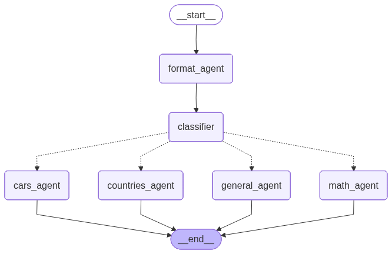

# RAG Project - Multi-Agent Q&A System

An intelligent RAG system using LangGraph with specialized agents for cars, countries, and math queries. Features tool-calling architecture where the cars agent dynamically chooses between SQL queries and vector search.

## 🚀 Key Features

- **ReAct Agent with Tools**: Cars agent intelligently selects between SQL database queries and vector search
- **DuckDB Integration**: SQL queries for counting, filtering, and aggregating car data
- **Multi-Agent Workflow**: Specialized routing for different query types
- **Interactive UI**: Chainlit web interface with expandable source citations
- **Vector Database**: ChromaDB for semantic search

## Workflow Architecture



The system uses a classifier to route queries to the appropriate agent. The cars agent uses a ReAct pattern with two tools:
- `query_cars_database`: SQL queries for statistics and filtering
- `search_cars_vector`: Semantic search for detailed car information

## 🛠️ Setup

```bash
# Install uv package manager
curl -LsSf https://astral.sh/uv/install.sh | sh

# Install dependencies
uv sync

# Configure API key
cp .env.example .env
# Add your OPENAI_API_KEY to .env

# Initialize databases (ChromaDB + DuckDB)
uv run python -c "from main import initialize; initialize()"
```

## 🎯 Usage

### Chainlit Web Interface
```bash
uv run chainlit run main.py
```
Visit `http://localhost:8000` for interactive chat with source citations.


## 📁 Project Structure

```
├── main.py                    # Chainlit interface + initialization
├── src/
│   ├── agents.py              # Agent implementations with tools
│   ├── classifier.py          # Query classification
│   ├── workflow.py            # LangGraph workflow
│   ├── ingestion.py           # Database initialization
│   └── models.py              # LLM configuration
├── data/
│   ├── cars_dataset.csv       # Car data (2000 entries)
│   └── country_data.md        # Country information
├── chroma_db/                 # Vector database
└── duckdb_cars.db             # SQL database
```

## 🤖 Agents

| Agent | Purpose | Examples |
|-------|---------|----------|
| **Cars Agent** | Cars queries (ReAct with tools) | "How many Teslas?", "Tell me about BMW X5" |
| **Countries Agent** | Geographic information | "Capital of Norway?" |
| **Math Agent** | Calculations | "Square root of 144?" |
| **General Agent** | Fallback handler | General queries |

### Cars Agent Tools

The cars agent automatically selects the appropriate tool:

**SQL Tool** (`query_cars_database`):
- Counting: "How many cars in the database?"
- Filtering: "Cars with rating > 4.5"
- Aggregation: "Average rating by manufacturer"

**Vector Search** (`search_cars_vector`):
- Semantic queries: "Tell me about Tesla Model S"
- Features: "What are the safety features of BMW?"
- Descriptions: "Electric cars with good ratings"


## 🔧 Technologies

- **LangChain + LangGraph**: Agent orchestration
- **OpenAI GPT-4o-mini**: LLM
- **ChromaDB**: Vector database
- **DuckDB**: SQL database
- **Chainlit**: Web UI
- **uv**: Package management

**Built with LangGraph 🦜🔗**